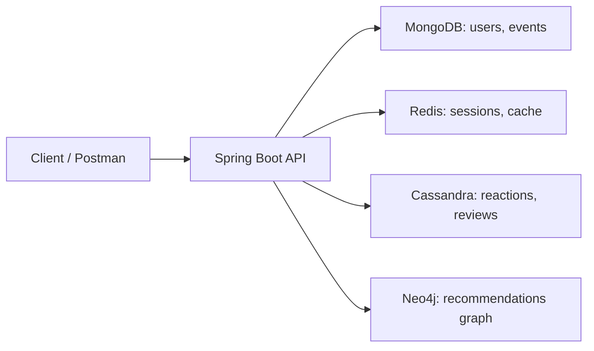
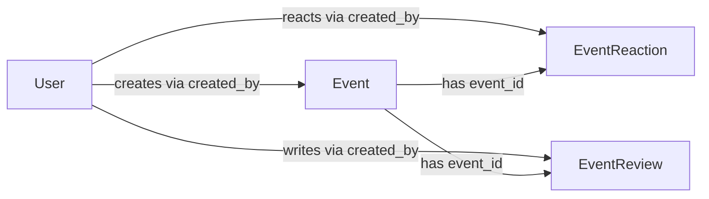

# EventHub

[](https://github.com/serkona/ndbx/actions/workflows/eventhub.yml)


EventHub - backend-сервис платформы мероприятий для практического изучения NoSQL баз данных. Сервис позволяет регистрировать пользователей, создавать события, искать мероприятия, ставить реакции, оставлять отзывы и получать рекомендации.

## Технологический Стек

| Компонент | Используется для |
| --- | --- |
| Java 17 | основной язык приложения |
| Spring Boot 3.2.2 | HTTP API и конфигурация приложения |
| Gradle | сборка проекта |
| Docker Compose | локальный запуск приложения и инфраструктуры |
| MongoDB | хранение пользователей и мероприятий |
| Redis | сессии, TTL и кэш агрегатов |
| Cassandra | реакции и отзывы к мероприятиям |
| Neo4j | граф лайков и рекомендательная логика |
| BCrypt | хэширование паролей |

Основные библиотеки:

| Библиотека | Назначение |
| --- | --- |
| `spring-boot-starter-web` | REST API, контроллеры, JSON over HTTP |
| `spring-boot-starter-data-mongodb` | работа с документами `users` и `events` |
| `spring-boot-starter-data-redis` | Redis-сессии и кэши с TTL |
| `spring-boot-starter-data-cassandra` | таблицы реакций и отзывов |
| `spring-boot-starter-data-neo4j` | подключение к Neo4j для графа рекомендаций |
| `jbcrypt` | безопасное хранение паролей через BCrypt hash |
| `spring-boot-starter-test` | тестовая инфраструктура Spring/JUnit |

Версии и полный список зависимостей указаны в [build.gradle](../build.gradle).

## Архитектура Проекта

### Структура пакетов

| Путь | Назначение |
| --- | --- |
| `controller` | HTTP-контроллеры: auth, users, events, reviews, reactions, recommendations |
| `service` | бизнес-логика и работа с Redis/Neo4j/агрегатами |
| `repository` | Spring Data репозитории для MongoDB и Cassandra |
| `model` | доменные сущности `User`, `Event`, `EventReaction`, `EventReview` |
| `config` | конфигурация Cassandra |
| `exception` | обработка ошибок и валидации |
| `util` | константы, cookie helper, offset pagination |

### Схема компонентов



### Связи сущностей



### Основные сущности

| Сущность | Ключевые поля | Связи |
| --- | --- | --- |
| `User` | `id`, `full_name`, `username`, `password_hash` | создает мероприятия, ставит реакции, пишет отзывы |
| `Event` | `id`, `title`, `description`, `category`, `price`, `location`, `started_at`, `finished_at` | принадлежит организатору через `created_by` |
| `EventReaction` | `event_id`, `created_by`, `like_value`, `created_at` | одна реакция пользователя на событие |
| `EventReview` | `id`, `event_id`, `created_by`, `comment`, `rating`, `created_at`, `updated_at` | один отзыв пользователя на событие |

## Функциональные Требования

| Use Case | Что делает пользователь |
| --- | --- |
| Регистрация и вход | создает аккаунт, входит по username/password, получает cookie-сессию |
| Работа с событиями | создает мероприятие, обновляет категорию/цену/город, ищет события по фильтрам |
| Просмотр пользователей | ищет пользователей и смотрит мероприятия конкретного пользователя |
| Реакции | ставит лайк или дизлайк мероприятию |
| Отзывы | создает и обновляет отзыв с рейтингом от 1 до 5 |
| Рекомендации | получает список рекомендованных мероприятий на основе графа лайков |

Типичный сценарий:

1. Пользователь создает сессию или регистрируется.
2. Создает мероприятие.
3. Другие пользователи находят мероприятие через фильтры.
4. Пользователи ставят лайки/дизлайки и оставляют отзывы.
5. Сервис использует граф лайков в Neo4j для рекомендаций.

## API

Подробное описание endpoint'ов находится в [API.md](API.md).

Postman collection расположена в [api/EventHub.postman_collection.json](api/EventHub.postman_collection.json). Описание коллекции и переменных находится в [api/README.md](api/README.md). В коллекции есть переменные `base_url`, `session_id`, `user_id`, `event_id`, `review_id`; часть запросов автоматически сохраняет id и cookie в переменные.

Быстрый пример:

```bash
curl -i -c cookies.txt -X POST http://localhost:8080/users \
  -H "Content-Type: application/json" \
  -d '{"full_name":"Ivan Petrov","username":"ivan","password":"secret"}'
```

```http
HTTP/1.1 201 Created
Set-Cookie: X-Session-Id=...
```

Создание события:

```bash
curl -i -b cookies.txt -X POST http://localhost:8080/events \
  -H "Content-Type: application/json" \
  -d '{"title":"NoSQL Meetup","description":"Discussion","address":"Kronverksky pr., 49","started_at":"2026-06-01T19:00:00Z","finished_at":"2026-06-01T21:00:00Z"}'
```

```json
{
  "id": "665a..."
}
```

Поиск мероприятий:

```bash
curl "http://localhost:8080/events?include=reactions,reviews&limit=10&offset=0"
```

```json
{
  "events": [
    {
      "id": "665a...",
      "title": "NoSQL Meetup",
      "description": "Discussion",
      "location": {
        "address": "Kronverksky pr., 49"
      },
      "created_by": "665b..."
    }
  ],
  "count": 1
}
```

Создание отзыва:

```bash
curl -i -b cookies.txt -X POST http://localhost:8080/events/{event_id}/reviews \
  -H "Content-Type: application/json" \
  -d '{"comment":"Great event","rating":5}'
```

```json
{
  "id": "b5c16332-7c87-4ff3-80d1-6712dd18a0b4"
}
```

## Запуск Проекта

### Требования

| Инструмент | Для чего нужен |
| --- | --- |
| Docker и Docker Compose | запуск приложения и NoSQL-инфраструктуры |
| Git | работа с репозиторием |
| Java 17 и Gradle | нужны только для локальной сборки без Docker |

### Пошаговый запуск

1. Склонируйте репозиторий и перейдите в папку проекта.

```bash
git clone <repo-url>
cd nosql
```

2. Проверьте `.env.local`. В репозитории уже есть локальные значения для разработки.

3. Запустите сервисы.

```bash
make run
```

4. Проверьте статус контейнеров.

```bash
make services
```

5. Проверьте API.

```bash
curl http://localhost:8080/health
```

Ожидаемый ответ:

```json
{
  "status": "ok"
}
```

Полезные команды:

| Команда | Назначение |
| --- | --- |
| `make run` | запустить все сервисы в фоне |
| `make rund` | запустить сервисы с логами в терминале |
| `make services` | показать статус контейнеров |
| `make stop` | остановить контейнеры |
| `make clean` | остановить контейнеры и удалить volumes |

## Конфигурация

| Переменная | Описание | Значение по умолчанию |
| --- | --- | --- |
| `SERVER_PORT` | порт Spring Boot внутри контейнера; передается из `APP_PORT` | `8080` |
| `APP_PORT` | порт приложения | `8080` |
| `APP_HOST` | host binding приложения | `0.0.0.0` |
| `APP_USER_SESSION_TTL` | TTL пользовательской сессии в Redis, секунды | `60` |
| `APP_LIKE_TTL` | TTL кэша реакций, секунды | `60` |
| `APP_EVENT_REVIEWS_TTL` | TTL кэша отзывов, секунды | `120` |
| `APP_RECOMMENDATIONS_TTL` | TTL кэша рекомендаций, секунды | `60` |
| `APP_EVENT_CATEGORIES` | доступные категории событий | `meetup,concert,exhibition,party,other` |
| `REDIS_HOST` | host Redis для приложения | `redis` |
| `REDIS_PORT` | порт Redis | `6379` |
| `REDIS_PASSWORD` | пароль Redis | пусто |
| `REDIS_DB` | номер Redis database | `0` |
| `REDIS_HEALTHCHECK_INTERVAL` | интервал healthcheck Redis | `5s` |
| `REDIS_HEALTHCHECK_TIMEOUT` | timeout healthcheck Redis | `3s` |
| `REDIS_HEALTHCHECK_RETRIES` | число попыток healthcheck Redis | `5` |
| `MONGODB_DATABASE` | база MongoDB | `eventhub` |
| `MONGODB_USER` | пользователь MongoDB | `root` |
| `MONGODB_PASSWORD` | пароль MongoDB | `root_password` |
| `MONGODB_HOST` | host MongoDB для приложения | `mongos` |
| `MONGODB_PORT` | порт MongoDB | `27017` |
| `MONGODB_AUTH_DATABASE` | auth database MongoDB | `eventhub` |
| `CASSANDRA_HOSTS` | contact points Cassandra | `cassandra` |
| `CASSANDRA_PORT` | порт Cassandra | `9042` |
| `CASSANDRA_USERNAME` | пользователь Cassandra | пусто |
| `CASSANDRA_PASSWORD` | пароль Cassandra | пусто |
| `CASSANDRA_KEYSPACE` | keyspace Cassandra | `eventhub` |
| `CASSANDRA_CONSISTENCY` | уровень consistency | `ONE` |
| `CASSANDRA_LOCAL_DATACENTER` | local datacenter | `datacenter1` |
| `CASSANDRA_HEALTHCHECK_INTERVAL` | интервал healthcheck Cassandra | `30s` |
| `CASSANDRA_HEALTHCHECK_TIMEOUT` | timeout healthcheck Cassandra | `10s` |
| `CASSANDRA_HEALTHCHECK_RETRIES` | число попыток healthcheck Cassandra | `10` |
| `CASSANDRA_HEALTHCHECK_START_PERIOD` | стартовый период healthcheck Cassandra | `60s` |
| `NEO4J_URL` | Bolt URL Neo4j | `bolt://neo4j:7687` |
| `NEO4J_USERNAME` | пользователь Neo4j | `neo4j` |
| `NEO4J_PASSWORD` | пароль Neo4j | `password` |
| `NEO4J_HTTP_PORT` | HTTP-порт Neo4j | `7474` |
| `NEO4J_BOLT_PORT` | Bolt-порт Neo4j | `7687` |
| `NEO4J_HEALTHCHECK_INTERVAL` | интервал healthcheck Neo4j | `10s` |
| `NEO4J_HEALTHCHECK_TIMEOUT` | timeout healthcheck Neo4j | `5s` |
| `NEO4J_HEALTHCHECK_RETRIES` | число попыток healthcheck Neo4j | `10` |
| `NEO4J_HEALTHCHECK_START_PERIOD` | стартовый период healthcheck Neo4j | `30s` |

## Тестирование

Основная проверка проекта в рамках курса выполняется автотестами autograder. В репозитории курса они находятся в [sitnikovik/ndbx/autograder](https://github.com/sitnikovik/ndbx/tree/main/autograder): каталог содержит Go-модуль и команды для лабораторных работ, например `cmd/lab1`, `cmd/lab2`, `cmd/lab3`, `cmd/lab4`.

В этом проекте workflow [`.github/workflows/eventhub.yml`](../.github/workflows/eventhub.yml) запускается на `push` и `pull_request` в `main`/`master` и вызывает reusable workflow курса:

```yaml
uses: sitnikovik/ndbx/.github/workflows/eventhub.yml@main
```

Кратко:

| Проверка | Как запускается |
| --- | --- |
| Autograder | автоматически в GitHub Actions после push/PR |
| Ручная проверка API | `make run`, затем импорт Postman collection |
| Локальные Gradle-тесты | `gradle test`, если установлен Gradle |

Autograder проверяет лабораторные требования и интеграционное поведение сервиса. Для текущей документации его можно считать основным набором автоматических тестов.

Покрытие проверок:

| Тип | Что покрывается |
| --- | --- |
| Unit | базовая тестовая инфраструктура подключена через `spring-boot-starter-test`; отдельные unit-тесты в репозитории не выделены |
| Integration/API | autograder поднимает сервис и проверяет лабораторные требования через API и инфраструктуру |
| Acceptance | сценарии регистрации, сессий, событий, реакций, отзывов и рекомендаций проверяются внешними автотестами курса |

Краткий запуск автотестов:

1. Откройте Pull Request или сделайте push в ветку, проверяемую GitHub Actions.
2. Дождитесь workflow `EventHub`.
3. Откройте job `autograder` и посмотрите результат по лабораторной работе.

## FAQ

**Q: Где смотреть API?**  
A: В [API.md](API.md) и Postman collection [api/EventHub.postman_collection.json](api/EventHub.postman_collection.json).

**Q: Как авторизуются запросы?**  
A: Через cookie `X-Session-Id`. Она создается в `/session`, `/users` или `/auth/login`.

**Q: Почему используется несколько NoSQL баз?**  
A: Это учебный проект: MongoDB отвечает за документы пользователей/событий, Redis - за TTL и кэш, Cassandra - за записи реакций/отзывов, Neo4j - за граф рекомендаций.

**Q: Как полностью сбросить локальное окружение?**  
A: Выполнить `make clean`, затем снова `make run`.

**Q: Где смотреть результаты автотестов?**  
A: Во вкладке GitHub Actions для workflow `EventHub`.
